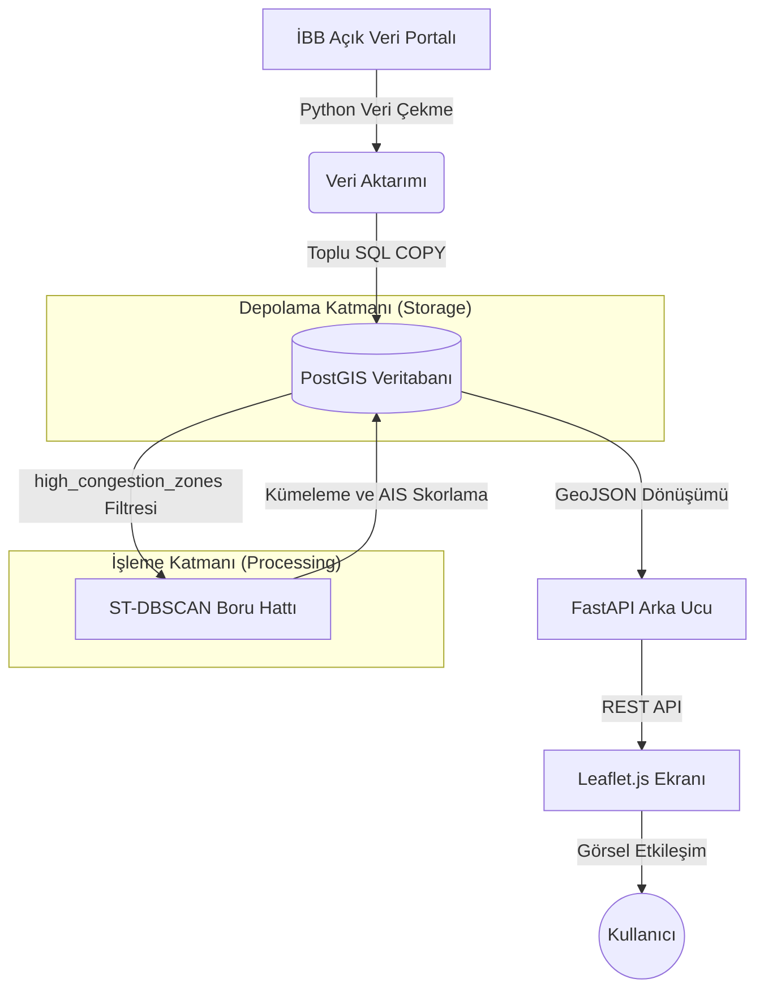

# 🚗 İstanbul Trafik Anomali Analizi (ST-DBSCAN)

Bu proje, İstanbul'da meydana gelen trafik anomalilerini tespit etmek, derecelendirmek ve harita üzerinde görselleştirmek için **ST-DBSCAN** (Uzamsal-Zamansal yoğunluk tabanlı kümeleme) ve **Anomali Şiddet Skorlaması (AIS)** kullanan yüksek performanslı bir analiz sistemidir.

Proje, raw (ham) İBB verisinin sisteme aktarılmasından, OSRM ile harita eşleştirmesine (map matching), oradan FastAPI tabanlı arka uca ve en son olarak Leaflet.js tabanlı etkileşimli bir ön uca (frontend) kadar Uçtan Uca (End-to-End) bir mimari barındırır.

---

## 🌟 Temel Özellikler

-   **ST-DBSCAN Kümeleme**: Spesifik bir lokasyonda uzun süre devam eden trafik tıkanıklıklarını (anomalileri) tespit eden uzamsal-zamansal (spatio-temporal) kümeleme algoritması.
-   **BallTree Optimizasyonu**: Scikit-learn'ün BallTree veri yapısı kullanılarak büyük veri kümeleri (1.7M+ satır) üzerinde mesafe matrisi oluşturmadan hafıza ve hız optimizasyonu.
-   **Anomali Şiddet Skoru (AIS - Anomaly Intensity Score)**: Kümeleri büyüklüklerine, etkinlik sürelerine ve hız düşüşlerine göre kritiklik seviyelerine (LOW, MEDIUM, HIGH) ayıran özel skorlama motoru.
-   **Geo-Bölümleme (Partitioning)**: Makine öğrenmesi pipeline'ını devasa veriler üzerinde daha stabil çalıştırmak için Geohash tabanlı bölgesel hesaplama yeteneği (Map-Reduce).
-   **İnteraktif Görselleştirme**: Leaflet.js kullanılarak geliştirilmiş, anomali kümelerinin detaylarını harita üzerinde interaktif olarak sunan modern ön yüz.
-   **OSRM (Open Source Routing Machine) Entegrasyonu**: Ham koordinatların en yakın "sürülebilir yol ağına" oturtulmasını sağlayan sistem (Map Snapping).
-   **Docker Uyumluluğu**: PostgreSQL/PostGIS, OSRM ve uygulamanın kolayca ayağa kalkabilmesi için tam konteyner (container) desteği.

---

## 🛠️ Teknoloji Yığını

| Katman | Teknolojiler |
| :--- | :--- |
| **Veri Bilimi (Data Science)** | Python 3.10+, Pandas, NumPy, Scikit-learn (BallTree) |
| **Veritabanı** | PostgreSQL 16+, PostGIS 3.4+ |
| **Arka Uç (Backend)** | FastAPI, Uvicorn, Asyncpg, Pydantic |
| **Ön Uç (Frontend)** | Vanilla JavaScript, Leaflet.js |
| **Altyapı** | Docker, Docker Compose, OSRM |

---

## 🏗️ Sistem Mimarisi



---

## 🚀 Başlangıç & Kurulum

### 1. Ön Koşullar
- [Docker](https://www.docker.com/) & [Docker Compose](https://docs.docker.com/compose/)
- Pipeline'ı yerel çalıştırmak için [Python 3.10+](https://www.python.org/)

### 2. Çevre Değişkenleri (Environment)
Projeyi klonlayın ve kök dizinde `.env` isimli dosyanızı oluşturun:
```bash
cp .env.example .env
# İçerisine PostgreSQL giriş bilgilerinizi tanımlayın.
```

### 3. Hızlı Başlangıç (Docker ile)
PostgreSQL dahil gerekli sunucuların otomatik kurulması için:
```bash
docker-compose up -d
```

### 4. Makine Öğrenmesi Akışını Çalıştırmak
Veritabanına eklenen verileri işleyip trafik kümelerini oluşturmak için:
```bash
# Bağımlılıkları yükleyin
pip install -r requirements.txt

# Temel ST-DBSCAN algoritmasını başlat
python run_pipeline.py

# Eğer veri çok büyükse yatay ölçeklendirmeli modül için
python run_pipeline.py --partitioned
```

---

## 📂 Dizin Yapısı Merkezi

-   `backend/`: FastAPI uygulaması, veritabanı iletişimi, servis mimarisi ve API uçları (routers).
-   `clustering/`: Çekirdek ST-DBSCAN implementasyonu, BallTree optimizasyonu ve Geohash-partition algoritması.
-   `frontend/`: Basit, tek dosyalık interaktif Leaflet.js ekranı (`index.html`).
-   `map_matching/`: OSRM yerel sunucusuna bağlanarak koordinatları gerçek yollara "oturtma" işlemleri.
-   `scoring/`: Üretilen kümelere önem dereceleri (LOW, MEDIUM, HIGH) belirleyen Anomaly Intensity Score (AIS) modülü.
-   `ingest_data.py`: Ham İBB verilerini okuyarak PostGIS üzerine geometrik veri (`GEOMETRY`) yapısıyla ekleyen yama.
-   `run_pipeline.py`: Tüm işlemleri uçtan uca kontrol edip tetikleyen ana makine öğrenmesi yöneticisi.

---

## 📚 Detaylı Mühendislik ve Teknik Analiz Belgesi

Eğer bu projenin arkasında yatan yazılım mühendisliği tasarımlarını, $O(n^2)$ karmaşıklığından BallTree optimizasyonuyla kurtulma matematiğini, `LRU Cache` mekaniğini ve dosya-dosya modüllerin ne işe yaradığını tam olarak anlamak isterseniz (veya yapay zeka ajanlarına bu proje üzerinden bir mimari iş yaptıracaksanız), lütfen **[ENGINEERING_DOCS.md](ENGINEERING_DOCS.md)** dosyasını okuyun. O doküman projede akılda kalabilecek hiçbir soru işareti bırakmayacaktır.

---

## 📡 API Uç Noktaları (Endpoints)

-   `GET /api/health`: Sistem servis durumu sorgulama.
-   `GET /api/clusters`: Otomatik olarak tespit edilen tüm trafik anomalilerini `GeoJSON FeatureCollection` olarak getirir.
-   `GET /docs`: Etkileşimli Swagger UI dokümantasyonu arayüzüne giriş noktası.

---

## 📈 Metodoloji: ST-DBSCAN ve AIS Skoru

Bu projede uygulanan özel ST-DBSCAN yaklaşımı üç temel parametreye dayanır:
-   **Eps1 (Uzamsal/Mekansal Hata Payı)**: Metre cinsindendir, max mesafe.
-   **Eps2 (Zamansal Eşik)**: Saniye cinsindendir, noktalar arası maksimum zaman farklılığı.
-   **MinPts**: Bir kümenin "anomali" sayılabilmesi için içermesi gereken asgari nokta adedi.

**Anomali Şiddet Skoru (AIS - Anomaly Intensity Score)** ise kabaca şu ilkeye dayanır:
$$AIS= \frac{N_{NoktaSayısı} \times \text{SüreklilikZamanı}}{\text{OrtalamaHız}}$$
Şehir yöneticilerinin müdahale etmesi gereken asıl kritik tıkanıklıklar AIS puanı en yüksek olan ("HIGH") alanlardır.

---

*Proje Geliştiricisi: [Fikrat Nizamioglu](https://github.com/f-nizamioglu)*
